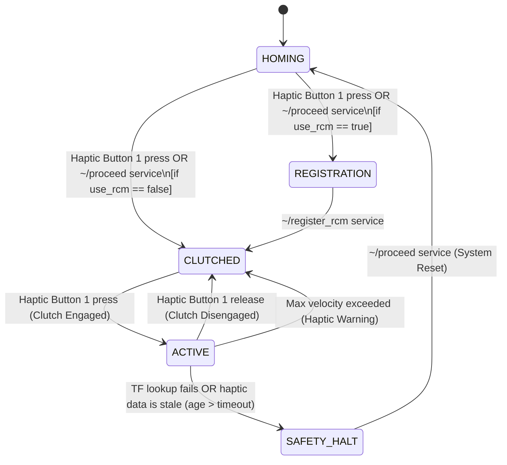

# phantom_panda_teleop

`phantom_panda_teleop` is a ROS 2 package designed for unilateral teleoperation of a Franka Emika Research 3 (Panda/FR3) robot using a 3D Systems Touch (formerly Phantom Omni) haptic device. This package was developed for the **BioRob 2026 Challenge: Dexterous Manipulation for Robotic Surgery**, where the primary objective is to teleoperate the robot to perform a peg-transfer task within a constrained surgical trainer box under Remote Center of Motion (RCM) constraints.

---

## 🦾 System Architecture & Data Flow

Below is the high-level data flow representing how the master device controls the slave manipulator:

```
[ Master Device ]                              [ Teleop Mapping Node ]                         [ Slave Robot ]
3D Systems Touch  -->  ~/joy (100Hz+)  -->   Filters -> RCM Constraint Logic  -->  TwistStamped  -->  MoveIt 2 Servo  -->  Franka Arm
                        (Stylus state)       (Butterworth & Deadband)            (Cartesian Vel)     (Joint Positions)    (ros2_control)
```

1. **Haptic Interface Layer (Master)**: The driver publishes haptic device states (stylus 6-DoF pose and stylus button presses).
2. **Teleoperation Mapping Node (Core)**: The `phantom_panda_teleop_node` reads haptic stylus movements, filters out tremors, scales inputs down for microscale precision, handles clutch offsets/states, and dynamically enforces RCM constraints.
3. **Robot Control Layer (Slave)**: MoveIt 2 Servo processes high-rate Cartesian velocity commands (`TwistStamped`), performs real-time inverse kinematics (IK) and safety checks, and streams joint trajectories to `ros2_control` (Franka ROS 2 driver).

---

## 🎛️ Operational State Machine

The node operates a strict internal state machine to manage safety, calibration, and user interaction:

* **`HOMING`**: Initial state where the robot arm configuration is prepared. The operator manually guides the robot flange to the initial position above the trainer box, then presses the front button on the stylus (or calls the `~/proceed` service) to transition.
* **`REGISTRATION`**: Alignment phase for Trocar calibration. The operator places the physical tool tip at the center of the trocar port and calls the `~/register_rcm` service. The node computes the 3D Remote Center of Motion (RCM) point and transitions to `CLUTCHED`.
* **`CLUTCHED`**: The robot's position is frozen (zero velocity is published) while the operator's hand is off the deadman switch (Button 1 = `0`). This allows the operator to comfortably reposition their hand/stylus.
* **`ACTIVE`**: The deadman clutch is engaged (Button 1 = `1`). Stylus movements are dynamically mapped to the robot, enforcing the RCM constraint.
* **`SAFETY_HALT`**: Halts all robot motions immediately if safety violations, singularities, or collisions are detected.



---

## 📐 Remote Center of Motion (RCM) Formulation

To simulate laparoscopic surgery, the custom tool shaft attachment must always intersect the fixed trocar port $\mathbf{p}_{\text{rcm}} = [x_{\text{rcm}}, y_{\text{rcm}}, z_{\text{rcm}}]^T$.
* Flange position: $\mathbf{p}_{\text{ee}}(t) = \mathbf{p}_{\text{rcm}} + \lambda_{\text{ee}}(t) \cdot \mathbf{u}(t)$
* Tool tip position: $\mathbf{p}_{\text{tip}}(t) = \mathbf{p}_{\text{rcm}} - \lambda_{\text{tip}}(t) \cdot \mathbf{u}(t)$
* Insertion Depth ($r$): $r = \lambda_{\text{tip}}(t) = L_{\text{tool}} - \lambda_{\text{ee}}(t)$

The node maps haptic stylus $(X, Y)$ displacements to spherical angles Azimuth ($\theta$) and Elevation ($\phi$) pivoting around the RCM, and stylus $Z$ displacement to the insertion depth ($r$). Flange rotation matrix $\mathbf{R}_{\text{ee}}$ is calculated dynamically to keep the tool shaft's approach vector (local Z-axis) pointing directly through $\mathbf{p}_{\text{rcm}}$.

---

## ⚙️ ROS 2 Parameters

All parameters are configured in [config/teleop_params.yaml](file:///home/tbs-panda/hans_ws/src/phantom_panda_teleop/config/teleop_params.yaml).

### Node Parameters (`/phantom_panda_teleop_node`)

| Parameter Name | Data Type | Default Value | Description |
| :--- | :--- | :--- | :--- |
| `update_rate` | `double` | `200.0` | Execution frequency (Hz) of the core control and publication loop. |
| `haptic_base_frame` | `string` | `"touch_x_base"` | TF frame ID representing the base of the haptic device. |
| `haptic_ee_frame` | `string` | `"touch_x_ee"` | TF frame ID representing the end-effector/stylus of the haptic device. |
| `robot_base_frame` | `string` | `"fr3_link0"` | TF frame ID representing the base of the Franka robot. |
| `robot_ee_frame` | `string` | `"fr3_hand"` | TF frame ID representing the end-effector/flange of the Franka robot. |
| `k_theta` | `double` | `2.0` | Scaling factor mapping haptic stylus lateral offset to azimuth angle ($\theta$). |
| `k_phi` | `double` | `2.0` | Scaling factor mapping haptic stylus vertical offset to elevation angle ($\phi$). |
| `k_r` | `double` | `0.5` | Scaling factor mapping haptic stylus depth offset to tool insertion depth ($r$). |
| `k_roll` | `double` | `1.0` | Scaling factor for the surgical tool's wrist roll rotation. |
| `deadband_position` | `double` | `0.0005` | Position deadband in meters ($0.5$ mm) to ignore minor stylus movements/tremor. |
| `cutoff_freq` | `double` | `5.0` | Cutoff frequency (Hz) for the Butterworth low-pass filter to suppress user hand tremor. |
| `rcm_x` | `double` | `0.4` | Initial $X$ coordinate of the RCM point in the robot base frame (meters). |
| `rcm_y` | `double` | `0.0` | Initial $Y$ coordinate of the RCM point in the robot base frame (meters). |
| `rcm_z` | `double` | `0.2` | Initial $Z$ coordinate of the RCM point in the robot base frame (meters). |
| `tool_length` | `double` | `0.25` | Length of the custom tool attachment (meters). |
| `gripper_action_name`| `string` | `"/franka_gripper/gripper_action"` | ROS 2 action name for controlling the Franka gripper. |
| `gripper_open_width` | `double` | `0.08` | Fully opened gripper width (meters). |
| `gripper_close_width`| `double` | `0.00` | Fully closed gripper width (meters). |
| `gripper_force` | `double` | `10.0` | Grip/clamping force limit (Newtons). |
| `use_rcm` | `bool` | `true` | Enables Remote Center of Motion constraints when true. If false, maps inputs directly to Cartesian coordinates. |
| `k_linear` | `double` | `0.2` | Scaling factor for direct Cartesian translation (only used when `use_rcm` is false). |
| `kp_pos` | `double` | `12.0` | Closed-loop proportional tracking gain for Cartesian positions. |
| `kp_rot` | `double` | `8.0` | Closed-loop proportional tracking gain for Cartesian orientations. |
| `max_linear_vel` | `double` | `0.15` | Limit for Cartesian linear velocity command (meters/sec). |
| `max_angular_vel` | `double` | `0.5` | Limit for Cartesian angular velocity command (rad/sec). |

### Dynamically Modifying Parameters via ROS 2 CLI

You can query and set parameters on the active `/phantom_panda_teleop_node` dynamically using standard `ros2 param` commands:

1. **List all active parameters:**
   ```bash
   ros2 param list /phantom_panda_teleop_node
   ```

2. **Retrieve the current value of a parameter (e.g., `use_rcm`):**
   ```bash
   ros2 param get /phantom_panda_teleop_node use_rcm
   ```

3. **Dynamically set/update a parameter (e.g., change `k_theta` scaling or toggle `use_rcm`):**
   ```bash
   # Toggle RCM constraints
   ros2 param set /phantom_panda_teleop_node use_rcm false

   # Update active scaling factors
   ros2 param set /phantom_panda_teleop_node k_theta 1.5

   # Update safety velocity bounds
   ros2 param set /phantom_panda_teleop_node max_linear_vel 0.20
   ```

> [!NOTE]
> Parameter updates targeting RCM coordinates (`rcm_x`, `rcm_y`, `rcm_z`) will take effect the next time the registration service `/phantom_panda_teleop_node/register_rcm` is called.

---

## 🏁 ROS 2 Interfaces (Topics, Services & Actions)

### Subscriptions
* **`/geomagic_touch_x/joy`** (`sensor_msgs/msg/Joy`):
  Listens to haptic buttons.
  - Button 1 (Front Button): Clutch deadman switch.
  - Button 2 (Rear Button): Gripper toggle switch.

### Publications
* **`/servo_node/delta_twist_cmds`** (`geometry_msgs/msg/TwistStamped`):
  Cartesian velocity commands published to MoveIt Servo at the frequency specified by `update_rate`.

### Services
* **`~/register_rcm`** (`std_srvs/srv/Trigger`):
  Queries the robot's current pose, computes the RCM trocar center based on the configured tool length and orientation, and registers it. Transitions state from `REGISTRATION` to `CLUTCHED`.
* **`~/proceed`** (`std_srvs/srv/Trigger`):
  Proceeds from the initial manual `HOMING` state. Transition will proceed to `REGISTRATION` if `use_rcm` is true, otherwise directly to `CLUTCHED`.

### Action Clients
* **`/franka_gripper/gripper_action`** (`control_msgs/action/GripperCommand`):
  Used to command gripper open/close states triggered by stylus Button 2.

---

## 🛠️ Build and Execution Instructions

### Sourcing & Compilation
Always source the workspace setup before compiling:
```bash
source /opt/ros/humble/setup.bash
source install/setup.bash
```

To compile only the teleop package:
```bash
colcon build --packages-select phantom_panda_teleop --symlink-install --cmake-args -DCMAKE_BUILD_TYPE=Release
```

### Launch Steps

#### 1. Start MoveIt, controllers, and robot hardware/simulation
For simulation/fake hardware:
```bash
ros2 launch phantom_panda_teleop biorob_moveit.launch.py use_fake_hardware:=true
```
For physical robot:
```bash
ros2 launch phantom_panda_teleop biorob_moveit.launch.py use_fake_hardware:=false robot_ip:=<ROBOT_IP>
```

#### 2. Launch the Teleop node & Haptic Driver
```bash
ros2 launch phantom_panda_teleop teleop.launch.py use_rcm:=true
```
*(Optionally override the parameter configuration file by passing `params_file:=/path/to/yaml`)*

#### 3. Start MoveIt Servo Node
```bash
ros2 launch phantom_panda_teleop servo.launch.py use_fake_hardware:=true
```

#### 4. Calibrate and Teleoperate
1. Under `HOMING` state, manually guide the robot flange to the initial configuration above the trainer box.
2. Press the stylus front button or call the service:
   ```bash
   ros2 service call /phantom_panda_teleop_node/proceed std_srvs/srv/Trigger
   ```
3. Under `REGISTRATION` state, position the tool tip at the trocar center and register the RCM:
   ```bash
   ros2 service call /phantom_panda_teleop_node/register_rcm std_srvs/srv/Trigger
   ```
4. Now in `CLUTCHED` state, hold the stylus front button to enter `ACTIVE` state and start teleoperating!
