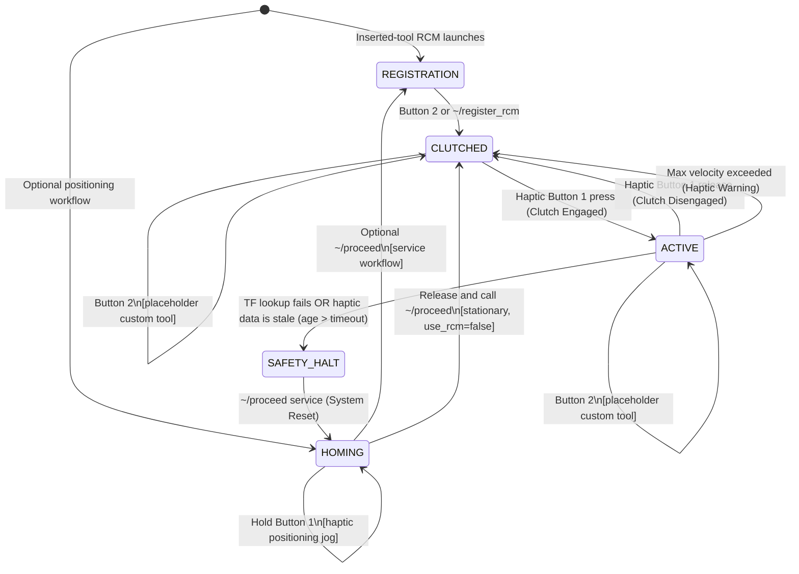

# phantom_panda_teleop

`phantom_panda_teleop` is a ROS 2 package designed for unilateral teleoperation of a Franka Emika Research 3 (Panda/FR3) robot using a 3D Systems Touch (formerly Phantom Omni) haptic device. This package was developed for the **BioRob 2026 Challenge: Dexterous Manipulation for Robotic Surgery**, where the primary objective is to teleoperate the robot to perform a peg-transfer task within a constrained surgical trainer box under Remote Center of Motion (RCM) constraints.

---

## 🦾 System Architecture & Data Flow

Below is the high-level data flow representing how the master device controls the slave manipulator:

```
[ Master Device ]                              [ Teleop Mapping Node ]                         [ Slave Robot ]
3D Systems Touch  -->  ~/joy (100Hz+)  -->   Filters -> RCM Constraint Logic  -->  TwistStamped  -->  MoveIt 2 Servo  -->  Franka Arm
                        (Stylus state)       (Butterworth & Deadband)            (Cartesian Vel)     (Joint Velocities)   (1 kHz limiter)
```

1. **Haptic Interface Layer (Master)**: The driver publishes the stylus pose and button presses. Teleoperation consumes only stylus position; stylus orientation is ignored.
2. **Teleoperation Mapping Node (Core)**: The `phantom_panda_teleop_node` filters and scales the clutch-relative stylus position into a Cartesian tool-tip target, projects that target into the feasible trocar cone and insertion interval, and reconstructs an RCM-valid flange pose.
3. **Robot Control Layer (Slave)**: MoveIt 2 Servo processes high-rate Cartesian velocity commands (`TwistStamped`), performs real-time inverse kinematics (IK) and safety checks, and streams joint trajectories to `ros2_control` (Franka ROS 2 driver).

---

## 🎛️ Operational State Machine

The node operates a strict internal state machine to manage safety, calibration, and user interaction:

* **`HOMING`**: Optional legacy positioning state for alternate workflows. The inserted-tool `rcm_sim` and `rcm_real` launches skip it completely.
* **`REGISTRATION`**: Stationary inserted-tool capture phase. The shaft's 80 mm marker must already be at the trocar; registration reconstructs the RCM 80 mm back from the distal tip along the shaft. Simulation captures automatically, while physical hardware requires Button 2 or `~/register_rcm` confirmation.
* **`CLUTCHED`**: The robot's position is frozen (zero velocity is published) while the operator's hand is off the deadman switch (Button 1 = `0`). This allows the operator to comfortably reposition their hand/stylus.
* **`ACTIVE`**: The deadman clutch is engaged (Button 1 = `1`). Stylus movements are dynamically mapped to the robot, enforcing the RCM constraint.
* **`SAFETY_HALT`**: Halts all robot motions immediately if safety violations, singularities, or collisions are detected.



---

## 📐 Remote Center of Motion (RCM) Formulation

To simulate laparoscopic surgery, the custom tool shaft attachment must always intersect the fixed trocar port $\mathbf{p}_{\text{rcm}} = [x_{\text{rcm}}, y_{\text{rcm}}, z_{\text{rcm}}]^T$.
* Flange position: $\mathbf{p}_{\text{ee}}(t) = \mathbf{p}_{\text{rcm}} + \lambda_{\text{ee}}(t) \cdot \mathbf{u}(t)$
* Tool tip position: $\mathbf{p}_{\text{tip}}(t) = \mathbf{p}_{\text{rcm}} - \lambda_{\text{tip}}(t) \cdot \mathbf{u}(t)$
* Insertion Depth ($r$): $r = \lambda_{\text{tip}}(t) = L_{\text{tool}} - \lambda_{\text{ee}}(t)$

The node first creates a scaled Cartesian tool-tip target from haptic position alone:

$$\mathbf{p}_{\text{tip,free}}=\mathbf{p}_{\text{tip},0}+s\,{}^r\!\mathbf{R}_h(\mathbf{p}_h-\mathbf{p}_{h,0}).$$

It projects that point into the permitted trocar cone and insertion interval. For the projected point, $r=\|\mathbf{p}_{\text{rcm}}-\mathbf{p}_{\text{tip}}\|$ and $\mathbf{u}=(\mathbf{p}_{\text{rcm}}-\mathbf{p}_{\text{tip}})/r$. The flange target is then $\mathbf{p}_{\text{ee}}=\mathbf{p}_{\text{rcm}}+(L_{\text{tool}}-r)\mathbf{u}$ and its local $+Z$ axis is constrained to $-\mathbf{u}$. Haptic orientation never enters this calculation; the clutch-time axial roll is preserved because RCM geometry itself leaves roll underdetermined.

---

## ⚙️ ROS 2 Parameters

All parameters are configured in [config/teleop_params.yaml](file:///home/tbs-panda/hans_ws/src/phantom_panda_teleop/config/teleop_params.yaml).

### Node Parameters (`/phantom_panda_teleop_node`)

| Parameter Name | Data Type | Default Value | Description |
| :--- | :--- | :--- | :--- |
| `update_rate` | `double` | `200.0` | Execution frequency (Hz) of the core control and publication loop. |
| `haptic_base_frame` | `string` | `"touch_x_base"` | TF frame ID representing the base of the haptic device. |
| `haptic_ee_frame` | `string` | `"touch_x_ee"` | TF frame ID representing the end-effector/stylus of the haptic device. |
| `robot_base_frame` | `string` | `"fr3_link0"` | TF frame ID representing the base of the Franka robot. |
| `robot_ee_frame` | `string` | `"fr3_link8"` | Franka flange TF frame. The Franka Hand is not loaded. |
| `robot_tool_tip_frame` | `string` | `"biorob_tool_tip"` | Explicit tool-tip TF captured when registering the trocar center. |
| `tip_position_scale` | `double` | `0.2` | Cartesian haptic-position to tool-tip-position scale; 10 mm hand motion requests 2 mm tip motion before RCM projection. |
| `command_max_tilt_angle` | `double` | `1.0472` | Interior RCM command cone from robot-base $+Z$ (60°). Targets outside it are projected inward. |
| `hard_max_tilt_angle` | `double` | `1.2217` | Empirically validated physical shaft-tilt limit (70°). Reaching it causes `SAFETY_HALT`. |
| `enable_tilt_haptic_cue` | `bool` | `true` | Enables the one-shot haptic cue when the shaft crosses the 60° command cone. |
| `haptic_wrench_topic` | `string` | `"/geomagic_touch_x/command/wrench"` | Touch driver force-command topic. |
| `tilt_cue_force` | `double` | `0.3` | Magnitude in N of each bounded haptic pulse (capped at 1.0 N). |
| `tilt_cue_pulse_duration` | `double` | `0.10` | Duration in seconds of each cue pulse. |
| `tilt_cue_gap_duration` | `double` | `0.08` | Zero-force interval between the two opposite-polarity pulses. |
| `enable_haptic_velocity_cue` | `bool` | `true` | Enables the one-shot cue after an OpenHaptics maximum-velocity warning. |
| `haptic_velocity_cue_force` | `double` | `0.25` | Magnitude in N of each haptic-speed warning pulse (capped at 1.0 N). |
| `haptic_velocity_cue_pulse_duration` | `double` | `0.08` | Duration in seconds of each haptic-speed warning pulse. |
| `haptic_velocity_cue_gap_duration` | `double` | `0.06` | Zero-force interval between the two haptic-speed warning pulses. |
| `tip_direction_transition_depth` | `double` | `0.02` | Insertion over which the projected shaft direction blends from its clutch-time direction, preventing tilt or azimuth steps at zero insertion. |
| `deadband_position` | `double` | `0.0005` | Position deadband in meters ($0.5$ mm) to ignore minor stylus movements/tremor. |
| `cutoff_freq` | `double` | `5.0` | Cutoff frequency (Hz) for the Butterworth low-pass filter to suppress user hand tremor. |
| `filtered_haptic_pose_topic` | `string` | `"~/filtered_haptic_pose"` | Monitoring topic for the clutch-relative, deadbanded and Butterworth-filtered stylus position plus low-pass-filtered stylus orientation (`geometry_msgs/PoseStamped`). |
| `rcm_x` | `double` | `0.4` | Initial $X$ coordinate of the RCM point in the robot base frame (meters). |
| `rcm_y` | `double` | `0.0` | Initial $Y$ coordinate of the RCM point in the robot base frame (meters). |
| `rcm_z` | `double` | `0.2` | Initial $Z$ coordinate of the RCM point in the robot base frame (meters). |
| `tool_length` | `double` | `0.25` | Length of the custom tool attachment (meters). |
| `min_insertion_depth` | `double` | `0.0` | Minimum permitted tip distance beyond the trocar (meters). |
| `max_insertion_depth` | `double` | `0.23` | Maximum insertion into the trainer box (meters); must remain below `tool_length`. |
| `registration_insertion_depth` | `double` | `0.08` | Known tip distance beyond the trocar when the shaft marker is aligned; mark the shaft 80 mm from its distal tip. |
| `rcm_hole_diameter` | `double` | `0.03` | Diameter of the horizontal trocar aperture shown in RViz (meters). |
| `shaft_diameter` | `double` | `0.008` | Physical instrument-shaft diameter (8 mm), validated against the RCM aperture and shown in RViz. |
| `shaft_marker_extension` | `double` | `0.15` | Distance that the shaft alignment line extends beyond the tool tip (meters). |
| `rcm_warning_error` | `double` | `0.002` | Measured shaft-line miss that turns the registered RCM marker red (meters). |
| `custom_tool_state_topic` | `string` | `"~/custom_tool_closed"` | Placeholder custom-tool output; `false=open`, `true=closed`. |
| `use_rcm` | `bool` | `true` | Enables Remote Center of Motion constraints when true. If false, maps inputs directly to Cartesian coordinates. |
| `k_linear` | `double` | `0.2` | Scaling factor for direct Cartesian translation (only used when `use_rcm` is false). |
| `robot_state_timeout` | `double` | `0.10` | Maximum accepted robot TF and direct joint-state feedback age (seconds). |
| `command_chain_timeout` | `double` | `0.25` | Maximum age of Servo output or arm-controller state before reporting a command-chain fault. |
| `positioning_mode` | `string` | `"fixed"` | `fixed`, haptic-driven `haptic_jog`, or optional `physical_guiding`. Both top-level RCM launches use `fixed`. |
| `start_in_registration` | `bool` | `false` | Skip `HOMING` and begin with an already positioned, inserted tool. Enabled by both RCM launches. |
| `auto_register_rcm` | `bool` | `false` | Automatically capture after stationary feedback. Enabled only by `rcm_sim`; physical capture remains operator-confirmed. |
| `controller_switch_service` | `string` | `"/controller_manager/switch_controller"` | Controller-manager service used to release and restore the real arm controller. |
| `arm_controller_name` | `string` | `"fr3_arm_controller"` | Arm command controller managed during physical guiding. |
| `positioning_max_linear_vel` | `double` | `0.01` | Maximum unconstrained simulation positioning speed (m/s). |
| `positioning_max_angular_vel` | `double` | `0.05` | Maximum unconstrained simulation positioning angular speed (rad/s). |
| `registration_joint_velocity_tolerance` | `double` | `0.01` | Maximum joint speed accepted for proceeding or RCM capture (rad/s). |
| `registration_settle_time` | `double` | `0.5` | Required stationary interval before proceeding or capture (seconds). |
| `joint_velocity_halt_limits` | `double[]` | `[0.4, 0.4, 0.4, 0.4, 0.8, 0.8, 0.8]` | Measured joint-speed guards that transition active teleoperation to `SAFETY_HALT`. |
| `kp_pos` | `double` | `12.0` | Closed-loop proportional tracking gain for Cartesian positions. |
| `kp_rot` | `double` | `8.0` | Closed-loop proportional tracking gain for Cartesian orientations. |
| `max_linear_vel` | `double` | `0.15` | Limit for Cartesian linear velocity command (meters/sec). |
| `max_angular_vel` | `double` | `0.5` | Limit for Cartesian angular velocity command (rad/sec). |
| `max_linear_accel` | `double` | `0.15` | Cartesian linear acceleration limit (meters/sec²). |
| `max_angular_accel` | `double` | `0.6` | Cartesian angular acceleration limit (rad/sec²). |
| `max_linear_jerk` | `double` | `1.0` | Cartesian linear jerk limit (meters/sec³). |
| `max_angular_jerk` | `double` | `4.0` | Cartesian angular jerk limit (rad/sec³). |

### Inspecting and Configuring Parameters

You can inspect parameters on the active `/phantom_panda_teleop_node` with standard ROS 2 commands. Mapping and safety values are loaded at node startup, so change the YAML or pass a different `params_file` and restart the node when tuning them.

1. **List all active parameters:**
   ```bash
   ros2 param list /phantom_panda_teleop_node
   ```

2. **Retrieve the current value of a parameter (e.g., `use_rcm`):**
   ```bash
   ros2 param get /phantom_panda_teleop_node use_rcm
   ```

3. **Change a value for the next launch:**
   ```bash
   # Edit config/teleop_params.yaml, rebuild if not using a symlink install,
   # then restart teleop.launch.py or rcm_sim.launch.py.
   ```

> [!NOTE]
> `rcm_x/y/z` define only the pre-registration candidate marker. Inserted-tool registration replaces them with $\mathbf p_{tip}-r_{reg}\mathbf z_{ee}$, where $r_{reg}$ is `registration_insertion_depth` and $\mathbf z_{ee}$ points from flange to tip.

---

## 🏁 ROS 2 Interfaces (Topics, Services & Actions)

### Subscriptions
* **`/geomagic_touch_x/joy`** (`sensor_msgs/msg/Joy`):
  Listens to haptic buttons.
  - Button 1 (Front Button): Clutch deadman switch.
  - Button 2 (Rear Button): RCM capture during `HOMING`/`REGISTRATION`; placeholder custom-tool toggle after capture.

### Publications
* **`/servo_node/delta_twist_cmds`** (`geometry_msgs/msg/TwistStamped`):
  Cartesian velocity commands published to MoveIt Servo at the frequency specified by `update_rate`.
* **`~/state`** (`std_msgs/msg/Int8`):
  Current state for diagnostics and rosbag capture (`0=HOMING`, `1=REGISTRATION`, `2=CLUTCHED`, `3=ACTIVE`, `4=SAFETY_HALT`).
* **`~/rcm_markers`** (`visualization_msgs/msg/MarkerArray`):
  The 30 mm horizontal trocar ring, exact RCM center, live shaft centerline, lateral-error line, and status label for RViz.
* **`~/rcm_error`** (`std_msgs/msg/Float64`):
  Shortest distance in meters between the registered RCM center and the measured flange-Z shaft line.
* **`~/custom_tool_closed`** (`std_msgs/msg/Bool`):
  Latched placeholder state for the future custom tool. Button 2 publishes `true` for close and `false` for open after RCM registration.

When launched through `rcm_sim.launch.py`, this state also drives the visual-only
placeholder grasper. Its two jaws pivot about `biorob_tool_tip`, while RViz shows
a green **GRIPPER: OPEN** or red **GRIPPER: CLOSED** status marker. The jaws carry
no collision geometry, so this does not change RCM registration or MoveIt safety
behaviour.

For a simulated haptic device, `rcm_sim.launch.py` auto-registers the RCM and
starts in `CLUTCHED`. Toggle the simulated rear button to test the grasper:

```bash
ros2 service call /sim_haptic/set_button2 std_srvs/srv/SetBool "{data: true}"
ros2 service call /sim_haptic/set_button2 std_srvs/srv/SetBool "{data: false}"
```

The rising edge closes the simulated jaws; the falling edge opens them.

### Services
* **`~/register_rcm`** (`std_srvs/srv/Trigger`):
  Service alternative to Button 2. It captures `biorob_tool_tip`, updates `rcm_x/y/z`, and transitions from `REGISTRATION` to `CLUTCHED`. Capture is rejected for a pressed clutch, moving/stale robot feedback, or a tool-tip frame not aligned with flange local +Z.
* **`~/proceed`** (`std_srvs/srv/Trigger`):
  Proceeds from `HOMING` only after positioning controls are released and the arm is stationary. The transition goes to `REGISTRATION` if `use_rcm` is true, otherwise to `CLUTCHED` after any required controller reactivation.

The Franka Hand and `franka_gripper` driver are intentionally absent from both launch paths.

---

## 🛠️ Build and Execution Instructions

### Sourcing & Compilation
Always source the workspace setup before compiling:
```bash
source /opt/ros/humble/setup.bash
source install/setup.bash
```

To compile only the teleop package:
```bash
colcon build --packages-select phantom_panda_teleop --symlink-install --cmake-args -DCMAKE_BUILD_TYPE=Release
```

### Launch Steps

#### MoveIt planning and execution from RViz

The planning launch is independent of the teleoperation stack. It starts
`move_group`, RViz, the BioRob tool model, and a trajectory controller exposing
`/fr3_arm_controller/follow_joint_trajectory`.

Test with fake hardware first:

```bash
ros2 launch phantom_panda_teleop moveit_rviz.launch.py
```

In RViz, select `fr3_arm` in the MotionPlanning panel, drag the goal-state
interactive marker, choose **Plan**, and then **Execute**. The fake-hardware path
uses a position interface so the commanded motion is visible in RViz.

For the physical FR3, unlock the robot and enable its external activation mode,
then run:

```bash
ros2 launch phantom_panda_teleop moveit_rviz.launch.py \
  use_fake_hardware:=false robot_ip:=<ROBOT_IP>
```

The physical path uses an effort-command `JointTrajectoryController` with the
standard Franka joint gains. RViz defaults to 10% velocity and acceleration
scaling. Do not run this launch at the same time as `rcm_real.launch.py` or
`biorob_moveit.launch.py`; each launch owns the arm hardware and activates a
different controller named `fr3_arm_controller`.

#### One-command RViz simulation

This path uses fake FR3 hardware and a fresh 200 Hz simulated haptic TF/Joy source:

```bash
ros2 launch phantom_panda_teleop rcm_sim.launch.py
```

To control the same fake FR3 simulation with a paired physical Geomagic Touch,
replace the simulated haptic source with the real driver:

```bash
ros2 launch phantom_panda_teleop rcm_sim.launch.py \
  use_haptic_driver:=true device_name:=left
```

Set `device_name` to the exact OpenHaptics name configured during pairing. The
launch argument is `use_haptic_driver` (including the final `r`). Only one of the
real or simulated haptic sources is launched.

The simulation controller manager is isolated at
`/rcm_sim_control/controller_manager`, so it does not collide with a separately running
Franka `/controller_manager`. Confirm both simulation controllers with:

```bash
ros2 control list_controllers \
  --controller-manager /rcm_sim_control/controller_manager
```

The RViz overlay uses:

- Blue shaft band: the 80 mm insertion mark that represents the trocar plane.
- Orange ring: brief pre-registration candidate, parallel to the `fr3_link0` XY plane.
- Cyan line: measured shaft centerline and its extension.
- Green ring: registered shaft miss is within `rcm_warning_error`.
- Red ring/segment: measured shaft miss exceeds the warning threshold.

The fake robot's existing startup pose is treated as already inserted through a trocar
at the blue band. The launch skips `HOMING`, starts in `REGISTRATION`, and automatically
computes the trocar as

$$\mathbf p_{rcm}=\mathbf p_{tip}-0.08\mathbf z_{ee}.$$

After stationary feedback has been present for `registration_settle_time`, state changes
automatically to `CLUTCHED` (`2`). There is no initial jog or Button 2 registration step:

```bash
ros2 topic echo --once /phantom_panda_teleop_node/state
```

Override the simulated marker depth only if the URDF marker is changed to match:

```bash
ros2 launch phantom_panda_teleop rcm_sim.launch.py \
  registration_insertion_depth:=0.08
```

Engage the deadman to start RCM-constrained teleoperation; simulated input stops
automatically 150 ms after Twist messages stop:

```bash
ros2 service call /sim_haptic/set_clutch std_srvs/srv/SetBool "{data: true}"
```

Monitor the numerical constraint error independently of RViz:

```bash
ros2 topic echo /phantom_panda_teleop_node/rcm_error
```

#### Physical FR3 and physical haptic

The real-hardware launch is intentionally separate from `rcm_sim.launch.py`:

```bash
ros2 launch phantom_panda_teleop rcm_real.launch.py \
  robot_ip:=<ROBOT_IP> device_name:="BioRob Haptic Device"
```

Before running this command, attach the tool, use the Franka's manual guiding controls,
insert it through the trocar, and align the center of the circumferential band located
80 mm from the distal tip with the trocar plane. Release all guiding controls and start
the launch without moving the robot. It starts directly in `REGISTRATION`; after
stationary feedback is available, press and release Button 2 to confirm the capture.
Do not press Button 1 until state is `2` (`CLUTCHED`):

```bash
ros2 control list_controllers -c /controller_manager
ros2 topic echo --once /phantom_panda_teleop_node/state
```

After registration, Button 2 toggles the placeholder `~/custom_tool_closed` output.
No Franka gripper process, finger model, or gripper controller is loaded.

#### 1. Start MoveIt, controllers, and robot hardware/simulation
For simulation/fake hardware:
```bash
ros2 launch phantom_panda_teleop biorob_moveit.launch.py use_fake_hardware:=true
```
For physical robot:
```bash
ros2 launch phantom_panda_teleop biorob_moveit.launch.py use_fake_hardware:=false robot_ip:=<ROBOT_IP>
```

#### 2. Start MoveIt Servo and the velocity bridge
```bash
ros2 launch phantom_panda_teleop servo.launch.py use_fake_hardware:=<true-for-fake-or-false-for-physical>
```

#### 3. Launch the Teleop node & Haptic Driver
```bash
ros2 launch phantom_panda_teleop teleop.launch.py use_rcm:=true
```
*(Optionally override the parameter configuration file by passing `params_file:=/path/to/yaml`)*

Servo intentionally runs without a pose-IK plugin and uses its differential Jacobian
solver for streamed Cartesian twists. The startup warning
`No kinematics solver instantiated ... Will use inverse Jacobian` is therefore expected;
the unified launch does not start MoveGroup or planned trajectory execution.

`servo.launch.py` also starts a bounded 100 Hz velocity bridge. The
`RealtimeServoVelocityController` consumes that stream in the ros2_control 1 kHz
update loop and rate-limits every individual hardware command. This final real-time
stage is important: limiting only successive ROS messages still creates 10 ms
velocity steps at the FCI interface, which can trigger libfranka's joint acceleration
or jerk discontinuity reflex. Both stages ramp safely toward zero when input becomes
stale.

The arm controller is intentionally streaming-only and does not expose a
`FollowJointTrajectory` action. Position and insert the physical tool before starting
the RCM launch.

#### 4. Calibrate and Teleoperate
1. Mark the physical shaft circumferentially 80 mm from the distal tip.
2. Before launch, manually guide the FR3 and align the band center with the trocar plane.
3. Release manual control and launch the stack without disturbing the pose.
4. Simulation registers automatically. On physical hardware, wait for state `1` and press Button 2; successful capture advances to state `2` (`CLUTCHED`).
5. Hold Button 1 to enter `ACTIVE`. Button 2 now publishes the placeholder custom-tool open/close state.
